# Setup

## 收音頁面

1. 在講桌電腦開啟 https://rozeta.coscup.prod.tw/setup （可能要輸入密碼）
   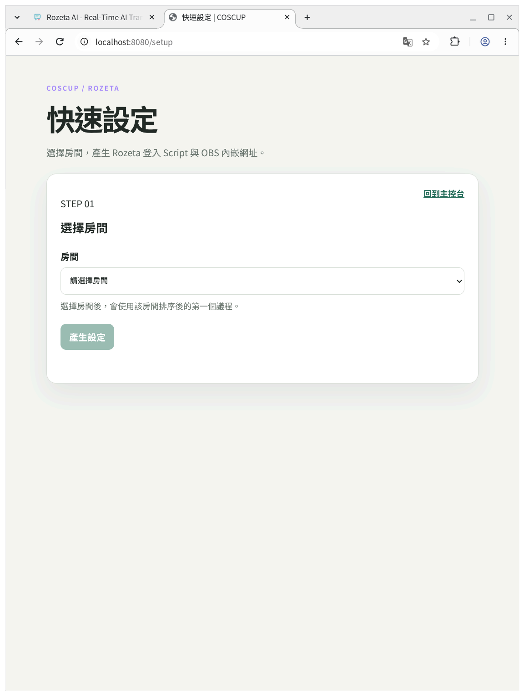
2. 選取你現在正在處理的這間教室，然後按下產生設定
   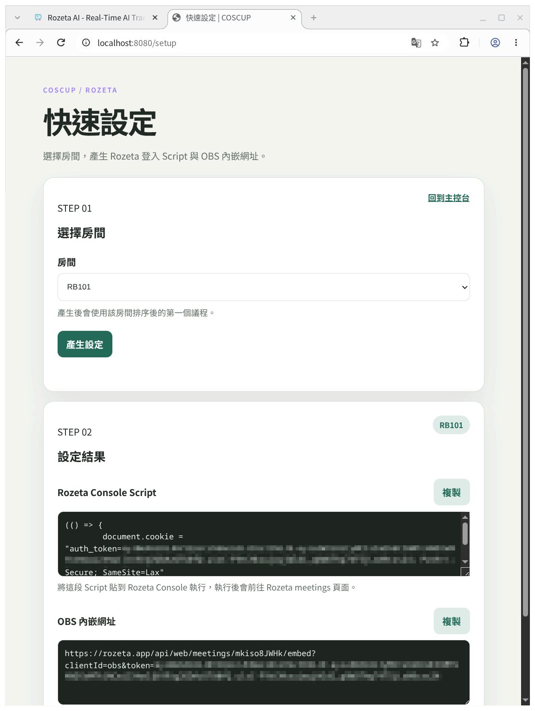
3. 複製「Rozeta Console Script」，然後在開啟 https://rozeta.app/ ，並用 `F12` 或是 `Ctrl+Shift+i` 開啟開發人員工具，然後把內容貼到控制台並執行
   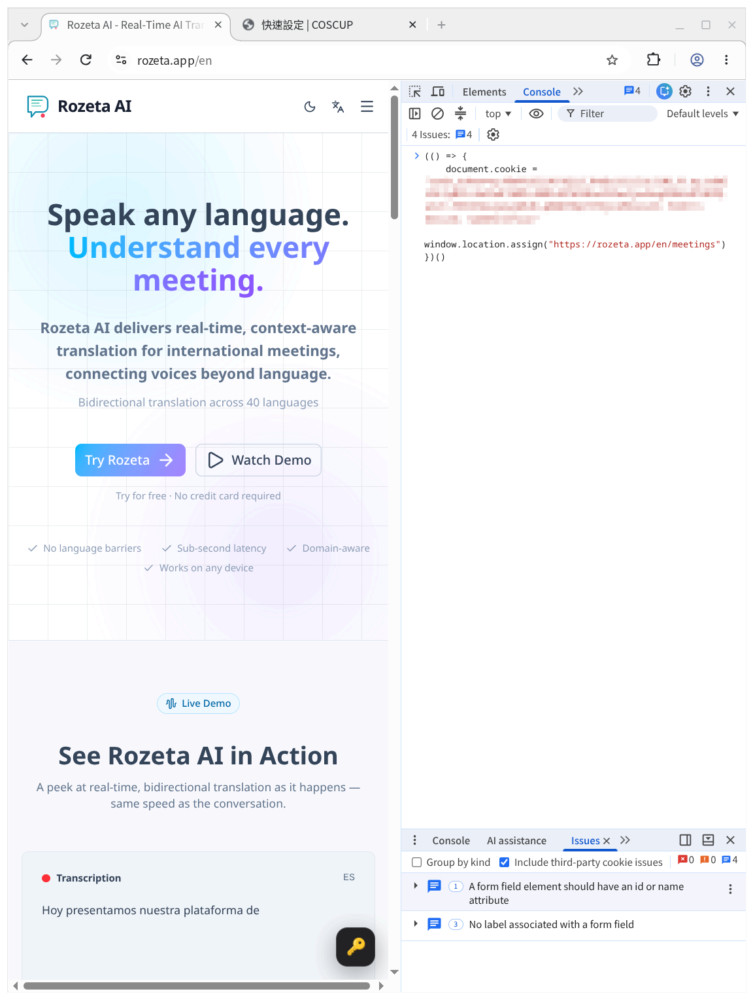
   接著網頁應該會自動跳到 https://rozeta.app/en/meetings
   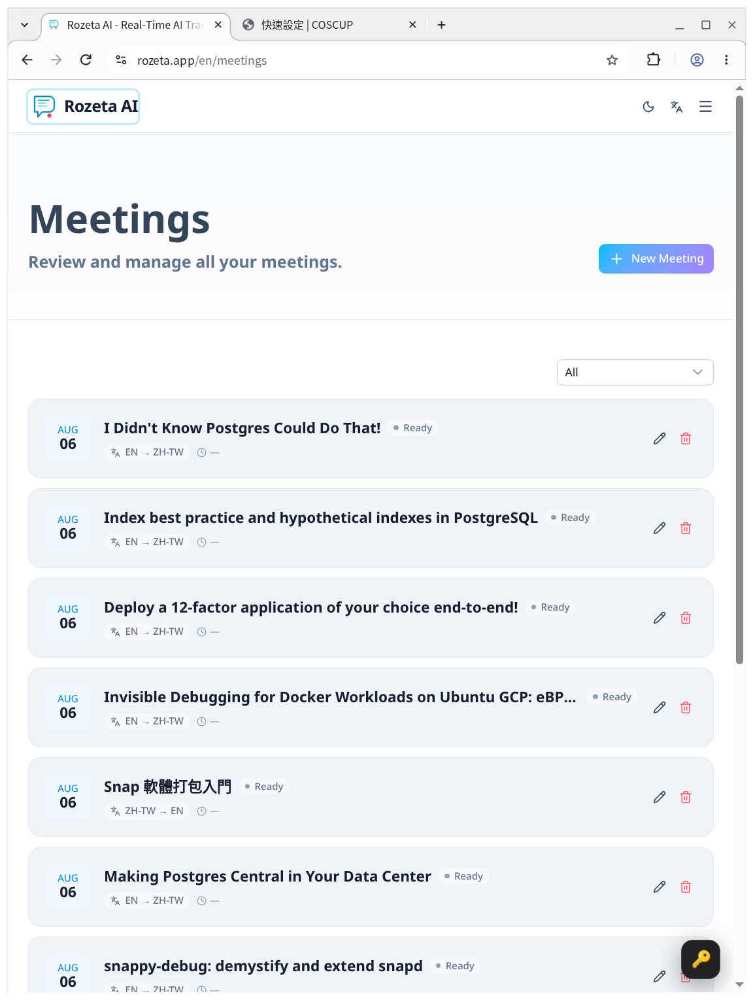
4. 隨便點一個 meeting（他這個不是照時間順序，你也不知道第一個是什麼，隨便點就好），不用點開始。
   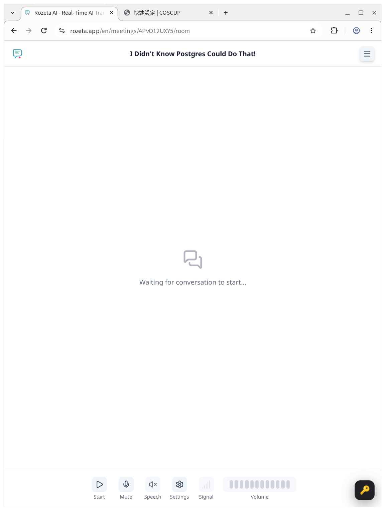

## OBS

1. 開啟 obs，找到來源「瀏覽器」，點擊屬性或是在「來源清單」內點兩下，會開啟這個視窗。然後把 https://rozeta.coscup.prod.tw/setup 複製出來的「OBS 內嵌網址」貼上，然後按下 OK

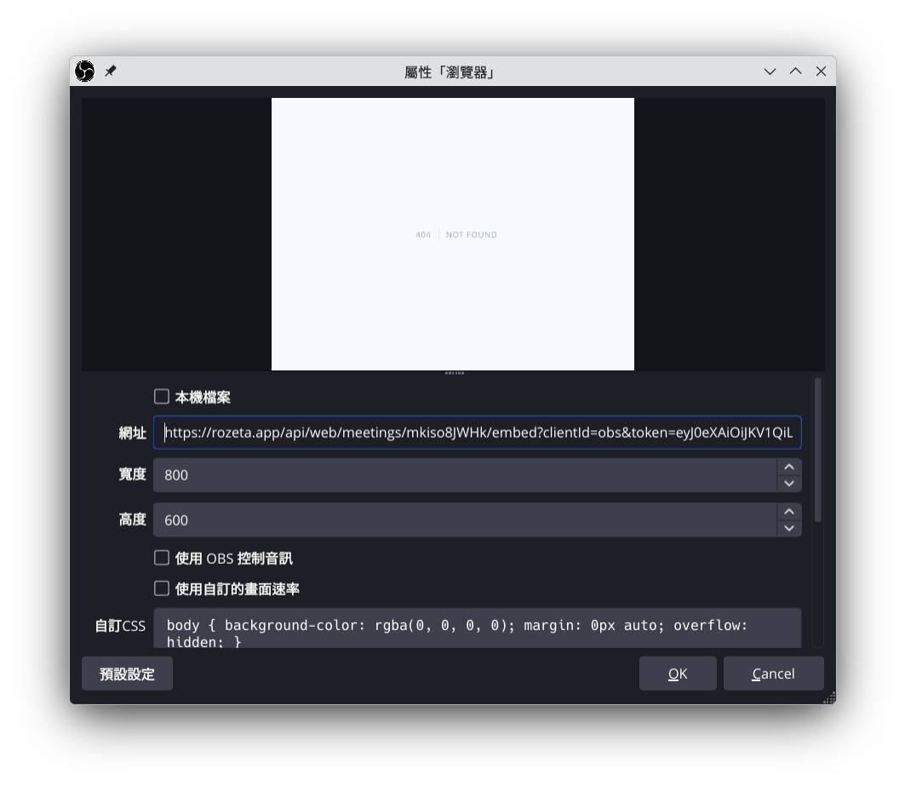

# 控制台

## 一般

1. 在你的裝置（手機、平板、筆電...）前往 https://rozeta.coscup.prod.tw/ ，（可能要輸入密碼）
   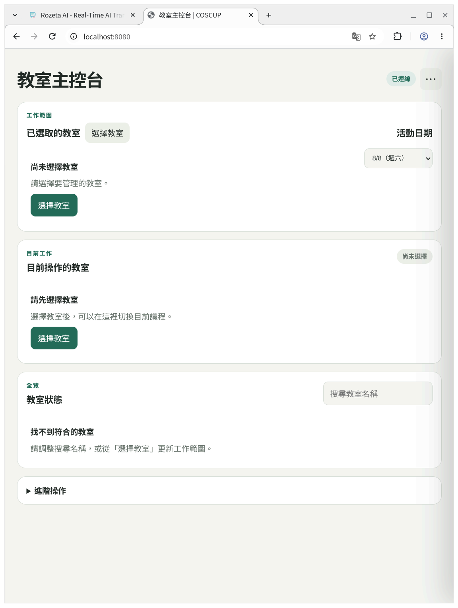
2. 點擊「選擇教室」，可以用前綴搜尋找到你負責的教室，把他們打勾
   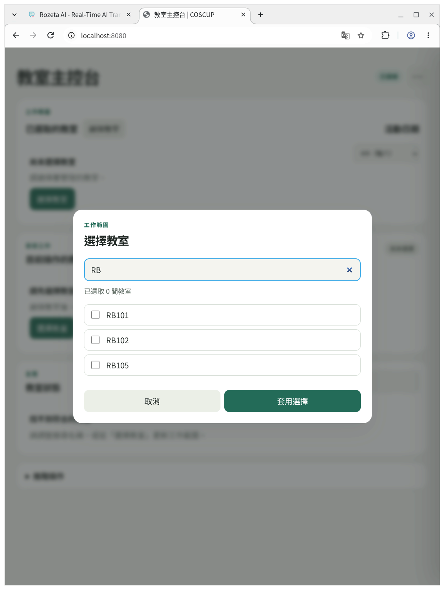
3. 接下來點擊 RB101、RB102 這些按鈕可以切換「目前操作的教室」，記得要設好右上角的「活動日期」，這樣議程才會正確顯示
   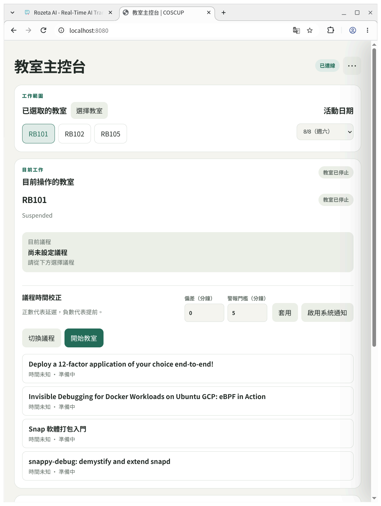
4. 接下來要啟動教室，首先先選取這間教室的第一個議程
   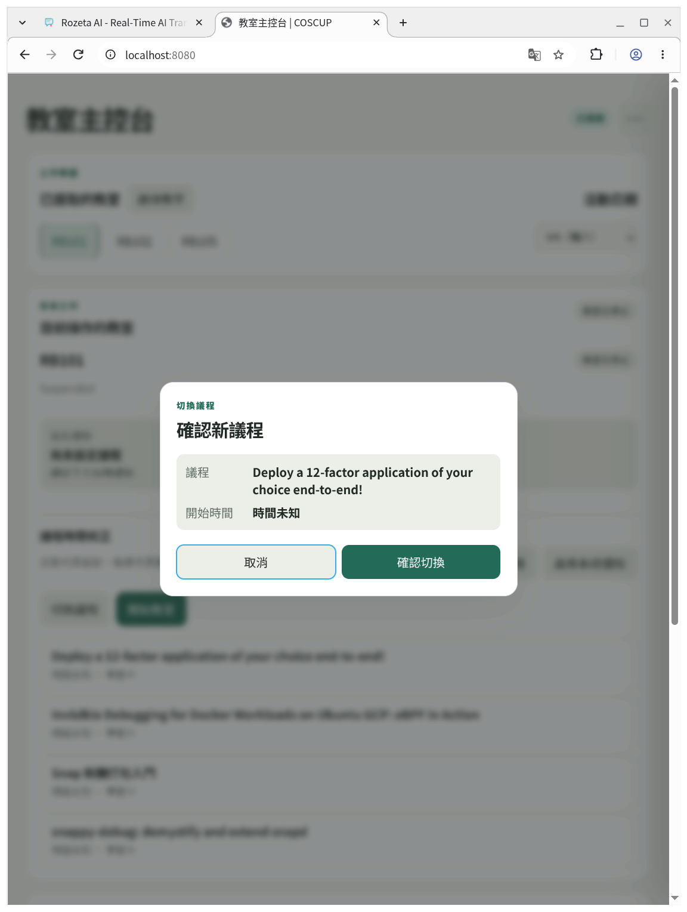
   然後按確認切換
   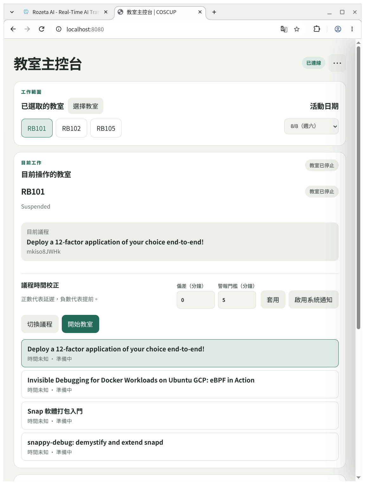
   注意到第一個議程有綠色高亮
5. 接著就可以點擊「開始教室」，注意到圖片中按鈕文字改了
   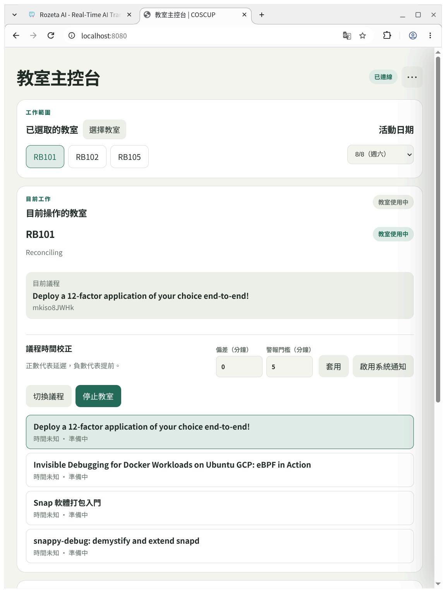
   你也可以在最下面一次看到所有你管理的教室的狀態
   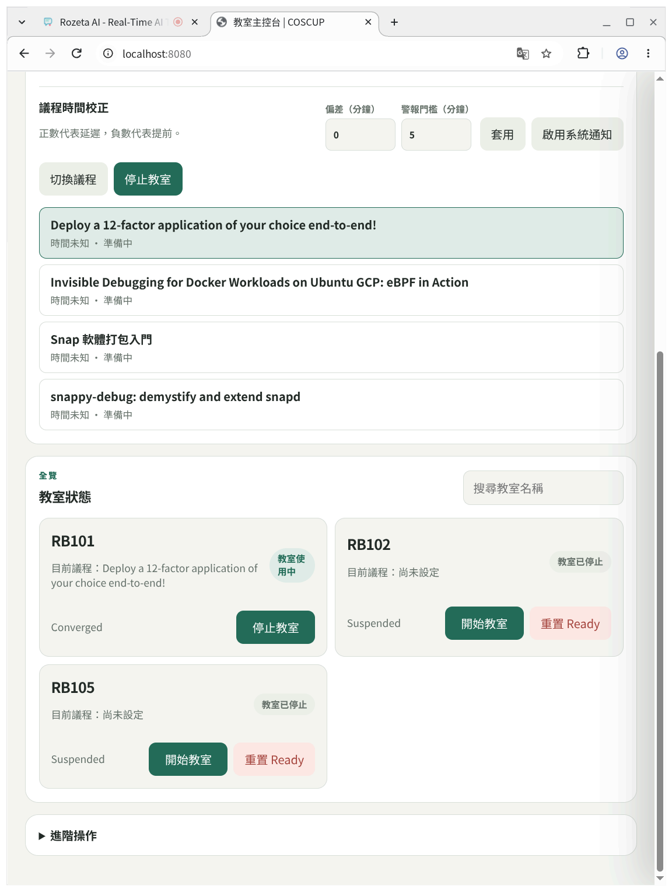

> Q: 開始教室後會發生什麼？  
> A: 系統會持續監測 rozeta 上面正在收音的議程和控制系統上面期望的「現在議程」是否一致，如果出現不一致就發出命令叫 rozeta 切換

## Delay 警告

接下來理論上議程主持人會自己按按鈕切換議程，都沒你的事，但是如果有議程離預計開始時間太久還沒開始，控制台會發出警告。

- 如果是忘記切、或是按太多下，導致實際進行的議程和系統的「現在議程」不一致，你可以手動在控制台切換。
- 如果是這個議程延後開始，你可以在「偏差（分鐘）」這個輸入調整，比如說接下來的議程全部往後延 10 分鐘，就在這裡填 10。而警報門檻則是當拖延太久時才會發出警報，發出警報的條件是

```
現在時間 >= 下一個議程開始時間 + 偏差 + 警報門檻
```
